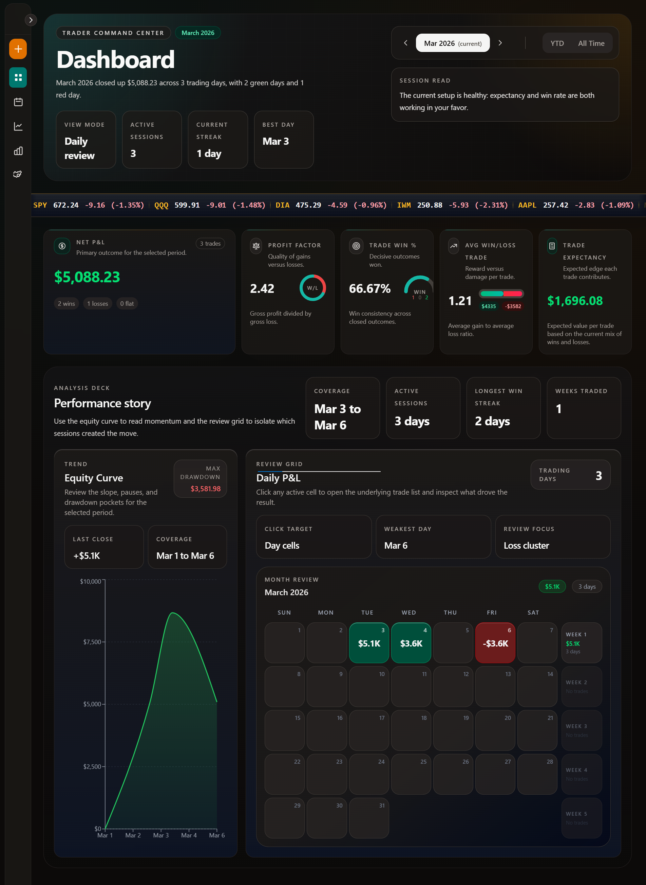
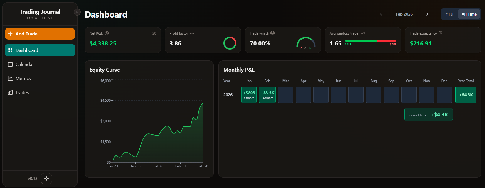
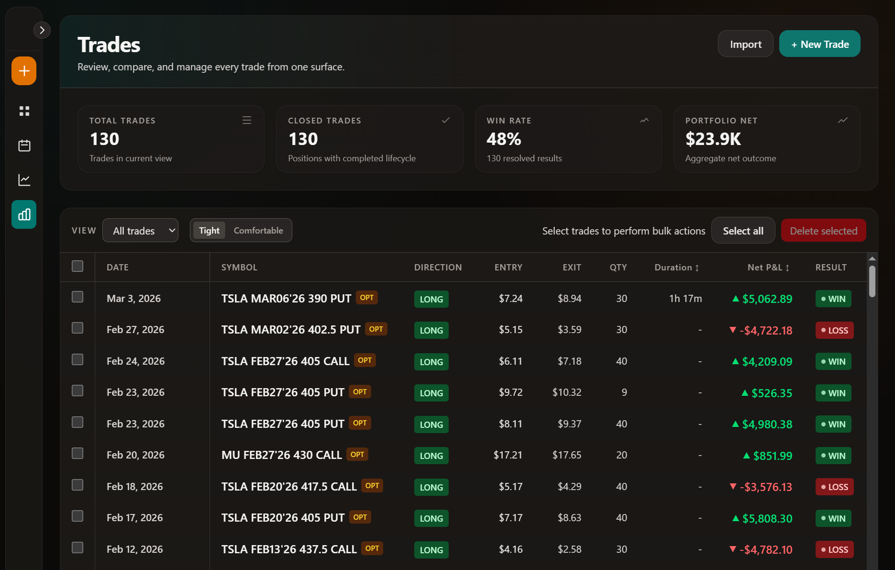
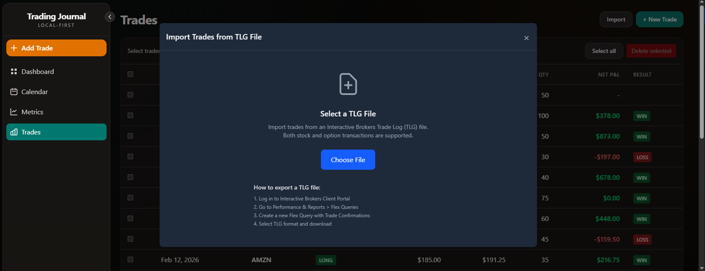
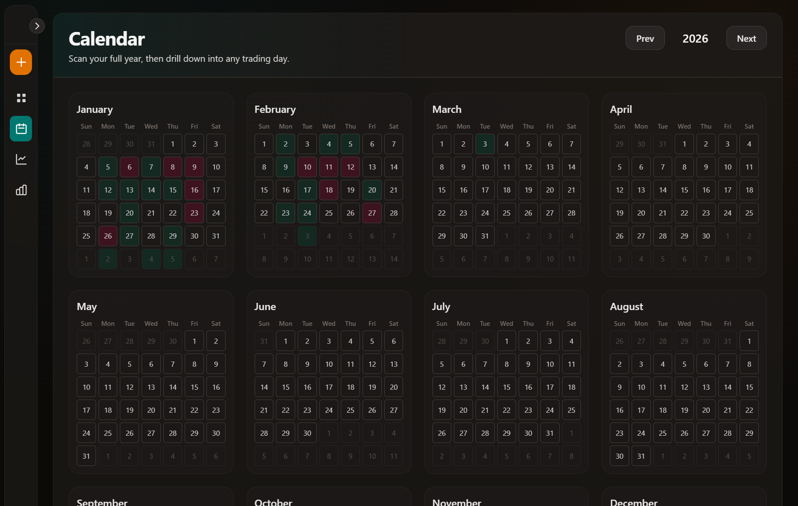
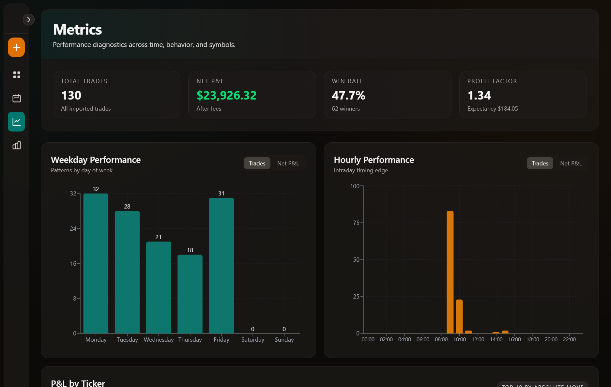

# Trading Journal

[](LICENSE)


A local-first desktop trading journal that helps you review performance, analyze behavior, and keep clean records without spreadsheets.

Built with **Tauri + React + TypeScript + Rust + SQLite**.

## Table of Contents

- [Why This Exists](#why-this-exists)
- [What You Can Do](#what-you-can-do)
- [Affiliation](#affiliation)
- [Screenshots](#screenshots)
- [Tech Stack](#tech-stack)
- [Architecture](#architecture)
- [Getting Started](#getting-started)
- [Commands](#commands)
- [IBKR TLG Import](#ibkr-tlg-import)
- [Data and Privacy](#data-and-privacy)
- [Current Limitations](#current-limitations)
- [Testing](#testing)
- [Troubleshooting](#troubleshooting)
- [Documentation](#documentation)
- [Roadmap](#roadmap)
- [Contributing](#contributing)
- [License](#license)

## Why This Exists

Many traders track results in spreadsheets, which creates friction for review and makes consistent analytics harder.

Trading Journal focuses on:

- Fast local workflows
- Reliable performance metrics
- Visual review (calendar + charts)
- Transparent trade-level detail

## What You Can Do

### Performance Review

- Dashboard KPI cards (net P&L, win rate, profit factor, expectancy)
- Equity curve visualization
- Daily and monthly P&L visualizations
- Calendar drill-down by day
- Metrics breakdown by weekday, hour, and ticker

### Trade Management

- Create, edit, and delete trades
- Bulk select and bulk delete
- Detailed trade view with derived fields

### Import Workflow (Interactive Brokers)

- Import from `.tlg` trade log files
- Preview trades before import
- Select/deselect individual grouped trades
- Detect and skip duplicates
- Show parser errors and open positions during preview

### UX

- Light/dark theme toggle
- Desktop-first native app experience

## Affiliation

This is an independent open-source project and is not affiliated with, endorsed by, or sponsored by any broker or journaling platform.

## Screenshots

### Dashboard


### Dashboard (All Time)


### Trades


### Import Preview (IBKR TLG)


### Calendar


### Metrics


## Tech Stack

- **Desktop Runtime:** Tauri 2
- **Frontend:** React 19, TypeScript, Vite, React Router
- **Styling:** Tailwind CSS 4
- **State Management:** Zustand
- **Charts:** Recharts
- **Backend:** Rust (Tauri commands/services)
- **Database:** SQLite via SQLx
- **Testing:** Vitest + Testing Library (frontend), Rust tests (backend)

## Architecture

```text
Tauri Shell
├── React Frontend (src/)
│   ├── views/
│   ├── components/
│   ├── stores/ (Zustand)
│   └── api/ (Tauri invoke wrappers)
└── Rust Backend (src-tauri/)
    ├── commands/ (Tauri command handlers)
    ├── services/ (business logic)
    ├── repository/ (SQLx data access)
    ├── calculations/ (PnL + metrics)
    └── models/

Storage: SQLite (local)
```

## Getting Started

### Prerequisites

- Node.js (LTS recommended)
- npm
- Rust toolchain (stable)
- Tauri system dependencies for your OS

References:

- Tauri prerequisites: https://v2.tauri.app/start/prerequisites/
- Rust install: https://www.rust-lang.org/tools/install

### Install and Run

```bash
# Install dependencies
npm install

# Frontend only (browser)
npm run dev

# Full desktop app (Tauri)
npm run tauri dev
```

## Commands

```bash
# Frontend
npm run dev
npm run build
npm run preview

# Frontend tests
npm run test
npm run test:run
npm run test:coverage

# Tauri
npm run tauri dev
npm run tauri build

# Backend tests
cd src-tauri && cargo test
```

## IBKR TLG Import

### In-App Flow

1. Open **Trades**.
2. Click **Import**.
3. Select a `.tlg` file.
4. Review grouped trades and parser feedback.
5. Select/deselect entries.
6. Confirm import.

### Exporting `.tlg` from IBKR

1. Log in to IBKR Client Portal.
2. Go to `Performance & Reports > Flex Queries`.
3. Create or run a query that includes trade confirmations.
4. Download in **TLG** format.

## Data and Privacy

- Local-first by design
- Trading data is stored locally in SQLite
- No cloud sync or external sharing built into this version

## Current Limitations

- Import currently targets Interactive Brokers `.tlg` format
- Mobile app is not included
- No direct broker API integrations yet
- No cloud backup/sync yet

## Testing

- Frontend unit/component tests with Vitest + Testing Library
- Backend tests with Rust `cargo test`

Run:

```bash
npm run test:run
cd src-tauri && cargo test
```

## Troubleshooting

### Tauri build/dev dependency issues

- Re-check OS prerequisites from Tauri docs
- Verify Rust toolchain and C/C++ toolchain are installed

### Import problems

- Ensure file extension is `.tlg`
- Use IBKR Flex Query export in TLG format
- Check parse warnings in the import preview dialog

## Documentation

- Product requirements: `docs/prd.md`
- Functional spec: `docs/functional-spec.md`
- Technical design: `docs/technical-design.md`
- Data model: `docs/data-model.md`
- Metrics and calculations: `docs/metrics-and-calculations.md`

## Roadmap

- Better onboarding and first-run experience
- More filters/search in trade list and analytics
- Export/reporting workflows
- Deeper strategy-level metrics

## Contributing

1. Fork the repo
2. Create a feature branch
3. Commit your changes
4. Open a pull request

For larger changes, include:

- Problem statement
- Proposed approach and tradeoffs
- Test coverage notes

## License

This project is licensed under the MIT License. See `LICENSE`.
