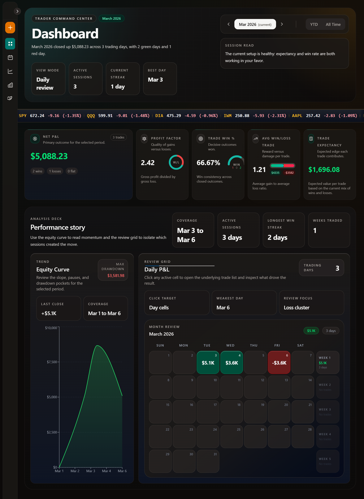
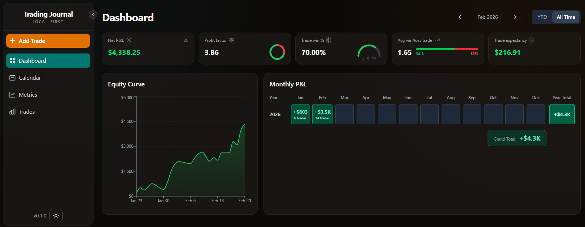
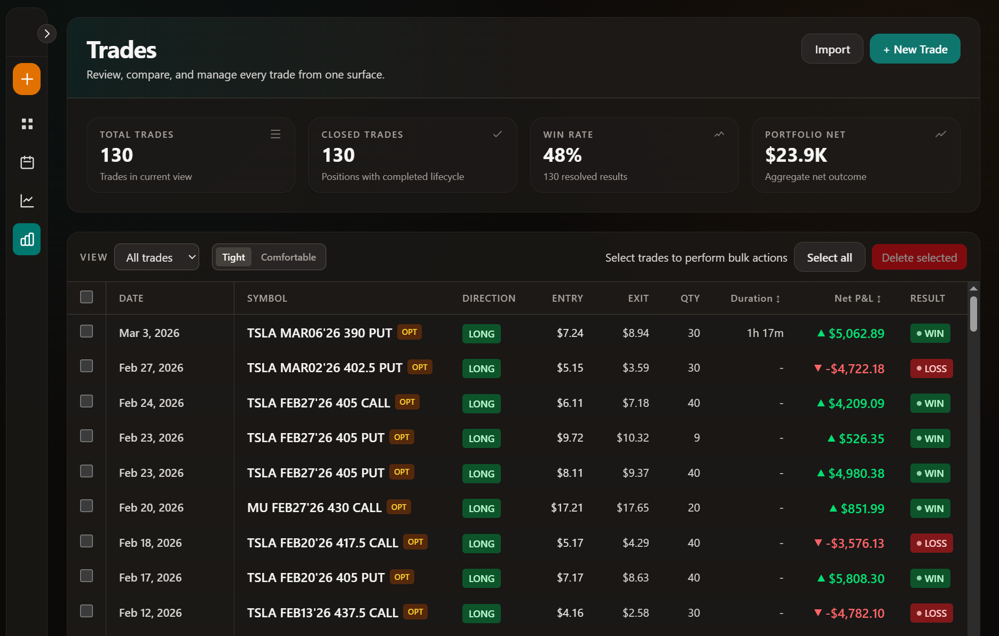
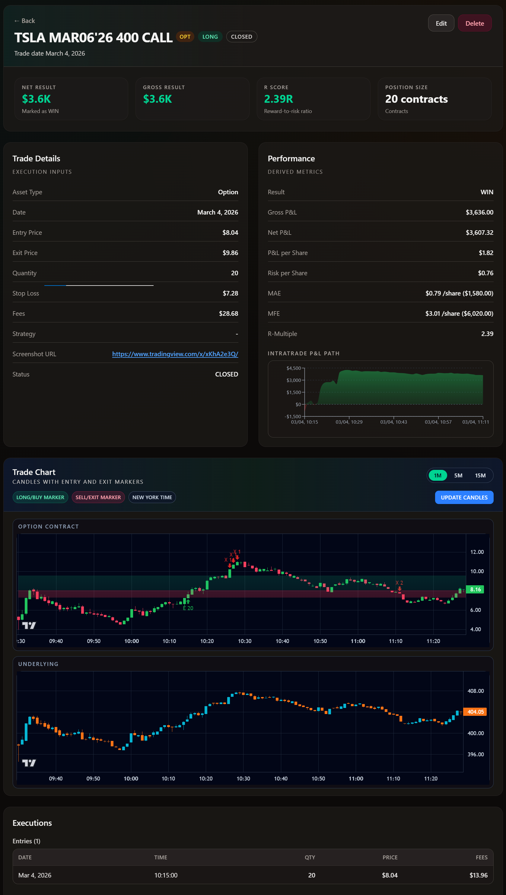
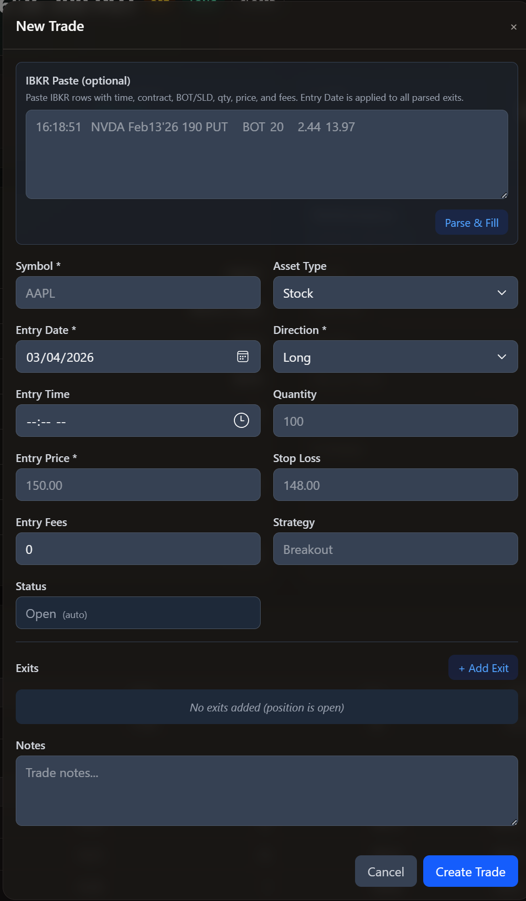
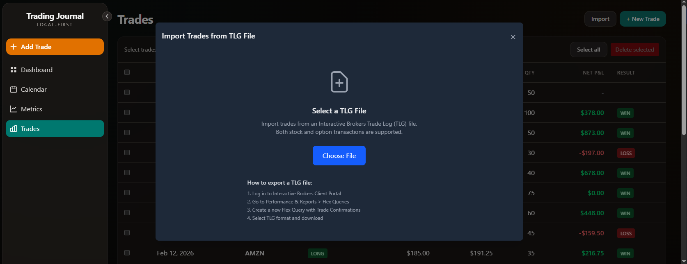
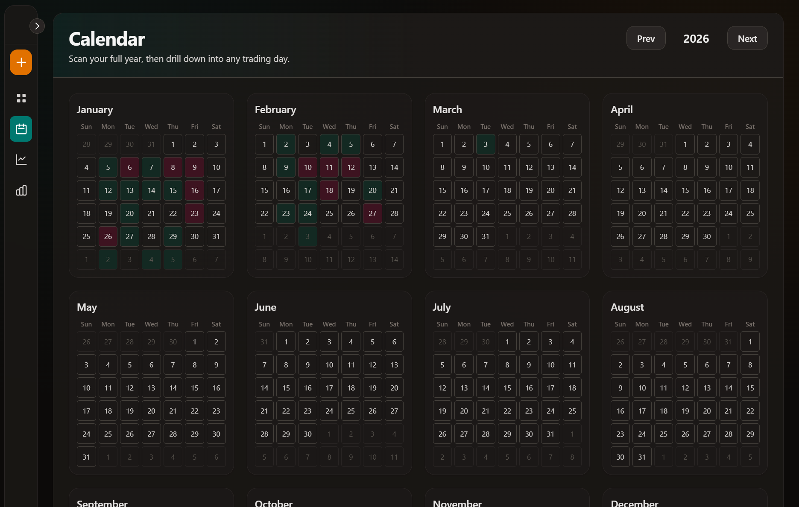
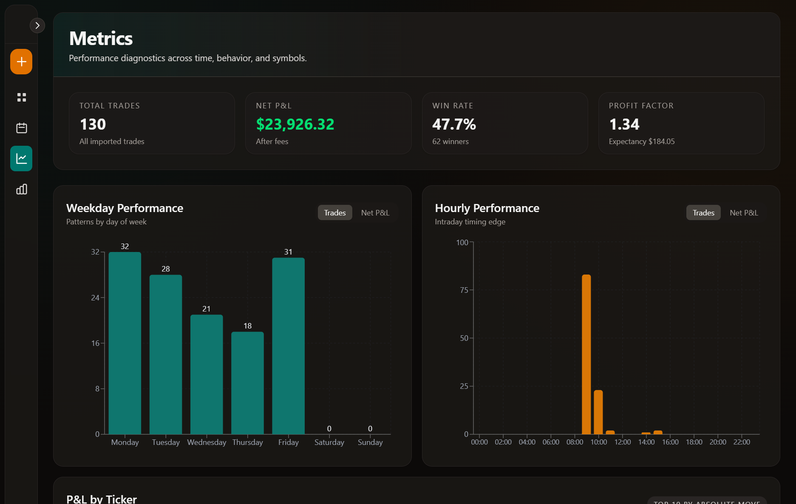

# Trading Journal

[](LICENSE)


A local-first desktop trading journal that helps you review performance, analyze behavior, and keep clean records without spreadsheets.

Built with **Tauri + React + TypeScript + Rust + SQLite**.

## Table of Contents

- [Why This Exists](#why-this-exists)
- [What You Can Do](#what-you-can-do)
- [Affiliation](#affiliation)
- [Screenshots](#screenshots)
- [Tech Stack](#tech-stack)
- [Architecture](#architecture)
- [Getting Started](#getting-started)
- [Alpaca API Keys](#alpaca-api-keys)
- [Commands](#commands)
- [IBKR TLG Import](#ibkr-tlg-import)
- [Data and Privacy](#data-and-privacy)
- [Current Limitations](#current-limitations)
- [Testing](#testing)
- [Troubleshooting](#troubleshooting)
- [Documentation](#documentation)
- [Roadmap](#roadmap)
- [Contributing](#contributing)
- [License](#license)

## Why This Exists

Many traders track results in spreadsheets, which creates friction for review and makes consistent analytics harder.

Trading Journal focuses on:

- Fast local workflows
- Reliable performance metrics
- Visual review (calendar + charts)
- Transparent trade-level detail

## What You Can Do

### Performance Review

- Dashboard KPI cards (net P&L, win rate, profit factor, expectancy)
- Equity curve visualization
- Daily and monthly P&L visualizations
- Calendar drill-down by day
- Metrics breakdown by weekday, hour, and ticker

### Trade Management

- Create, edit, and delete trades
- Bulk select and bulk delete
- Detailed trade view with derived fields

### Import Workflow (Interactive Brokers)

- Import from `.tlg` trade log files
- Preview trades before import
- Select/deselect individual grouped trades
- Detect and skip duplicates
- Show parser errors and open positions during preview

### UX

- Light/dark theme toggle
- Desktop-first native app experience

## Affiliation

This is an independent open-source project and is not affiliated with, endorsed by, or sponsored by any broker or journaling platform.

## Screenshots

### Dashboard


### Dashboard (All Time)


### Trades


### Trade Details


### New Trade


### Import Preview (IBKR TLG)


### Calendar


### Metrics


## Tech Stack

- **Desktop Runtime:** Tauri 2
- **Frontend:** React 19, TypeScript, Vite, React Router
- **Styling:** Tailwind CSS 4
- **State Management:** Zustand
- **Charts:** Recharts
- **Backend:** Rust (Tauri commands/services)
- **Database:** SQLite via SQLx
- **Testing:** Vitest + Testing Library (frontend), Rust tests (backend)

## Architecture

```text
Tauri Shell
├── React Frontend (src/)
│   ├── views/
│   ├── components/
│   ├── stores/ (Zustand)
│   └── api/ (Tauri invoke wrappers)
└── Rust Backend (src-tauri/)
    ├── commands/ (Tauri command handlers)
    ├── services/ (business logic)
    ├── repository/ (SQLx data access)
    ├── calculations/ (PnL + metrics)
    └── models/

Storage: SQLite (local)
```

## Getting Started

### Prerequisites

- Node.js (LTS recommended)
- npm
- Rust toolchain (stable)
- Tauri system dependencies for your OS

References:

- Tauri prerequisites: https://v2.tauri.app/start/prerequisites/
- Rust install: https://www.rust-lang.org/tools/install

### Install and Run

```bash
# Install dependencies
npm install

# Frontend only (browser)
npm run dev

# Full desktop app (Tauri)
npm run tauri dev
```

## Alpaca API Keys

Trading Journal uses Alpaca for market data. It is needed for features that fetch candles and live quote snapshots, including chart data around trades and the market tape.

Alpaca is not used here for order execution or account management. Your trade journal remains local-first, and the app stores the Alpaca API Key ID and Secret Key in the local app database through **Settings**.

### Why Alpaca Is Needed

- Fetches historical market candles used in trade charting
- Fetches live snapshot data used by the market tape
- Lets the app enrich locally stored trades with market context without requiring a custom data feed

### How to Get Alpaca Keys

1. Create or sign in to your Alpaca account.
2. Open the Alpaca dashboard.
3. Switch to the environment you want to use, usually **Paper Trading** for testing.
4. Generate or view your API keys in the dashboard's API/developer area.
5. Copy the **API Key ID** and **Secret Key** and save them immediately. Alpaca only shows the full secret at creation time; if you lose it, you need to regenerate the key pair.
6. In Trading Journal, open **Settings** and paste the keys into **Alpaca API Key ID** and **Alpaca API Secret Key**.

Notes:

- Paper and live environments use different credentials.
- If you regenerate keys in Alpaca, you must update them in Trading Journal.
- Alpaca docs for authentication and paper trading:
  - https://docs.alpaca.markets/docs/api-references/trading-api/
  - https://docs.alpaca.markets/docs/trading/paper-trading/

## Commands

```bash
# Frontend
npm run dev
npm run build
npm run preview

# Frontend tests
npm run test
npm run test:run
npm run test:coverage

# Tauri
npm run tauri dev
npm run tauri build

# Backend tests
cd src-tauri && cargo test
```

## IBKR TLG Import

### In-App Flow

1. Open **Trades**.
2. Click **Import**.
3. Select a `.tlg` file.
4. Review grouped trades and parser feedback.
5. Select/deselect entries.
6. Confirm import.

### Exporting `.tlg` from IBKR

1. Log in to IBKR Client Portal.
2. Go to `Performance & Reports > Flex Queries`.
3. Create or run a query that includes trade confirmations.
4. Download in **TLG** format.

## Data and Privacy

- Local-first by design
- Trading data is stored locally in SQLite
- No cloud sync or external sharing built into this version

## Current Limitations

- Import currently targets Interactive Brokers `.tlg` format
- Mobile app is not included
- No order execution or account sync integrations yet
- No cloud backup/sync yet

## Testing

- Frontend unit/component tests with Vitest + Testing Library
- Backend tests with Rust `cargo test`

Run:

```bash
npm run test:run
cd src-tauri && cargo test
```

## Troubleshooting

### Tauri build/dev dependency issues

- Re-check OS prerequisites from Tauri docs
- Verify Rust toolchain and C/C++ toolchain are installed

### Import problems

- Ensure file extension is `.tlg`
- Use IBKR Flex Query export in TLG format
- Check parse warnings in the import preview dialog

## Documentation

- Product requirements: `docs/prd.md`
- Functional spec: `docs/functional-spec.md`
- Technical design: `docs/technical-design.md`
- Data model: `docs/data-model.md`
- Metrics and calculations: `docs/metrics-and-calculations.md`

## Roadmap

- Better onboarding and first-run experience
- More filters/search in trade list and analytics
- Export/reporting workflows
- Deeper strategy-level metrics

## Contributing

1. Fork the repo
2. Create a feature branch
3. Commit your changes
4. Open a pull request

For larger changes, include:

- Problem statement
- Proposed approach and tradeoffs
- Test coverage notes

## License

This project is licensed under the MIT License. See `LICENSE`.
